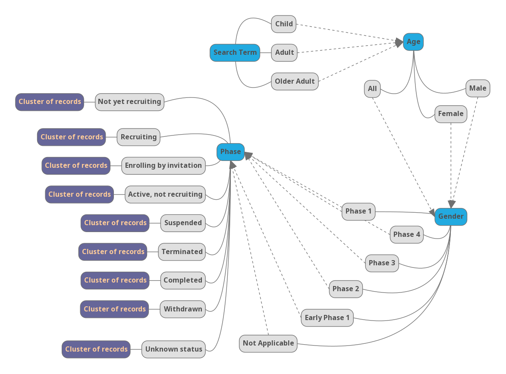

# CARETS APP
<!-- Put an image -->


## CA-ncer

## RE-lated

## T-erms

## S-earch

<!-- make horizontal line -->
<hr>

<!-- Table of content  -->
## Table of Contents
- [Introduction](#introduction)
- [Usage](#usage)
- [Python Requirements](#python-requirements)
- [Data Structure](#data-structure)


## Introduction

### One stop search application for cancer and related terms.

The impetus behind this search application is to provide one stop search for cancer and related terms. User can search for cancer and related terms and get results about the clinical trials and case studies. The application is built using Flask and Next.js.


## Usage

This is a dockerized application. To run the application, you need to have docker installed on your machine. Once, you have docker installed, you can run the application by following steps:

First of all, you need to get SEERS API key and store it in a file called `.env` in the a root directory of the backend. You can get the api key by registering here: https://api.seer.cancer.gov/. The file should look like this:

``` bash
SEERS_API_KEY=<your_api_key>
```

Then, you need to build the docker images for both the frontend and backend. To do that, run the following commands:

``` bash
docker-compose build
```

Once the images are built, you can run the application by running the following command:

``` bash
docker-compose up
```

The frontend will be running on port 3000 and backend will be running on port 5000. You can access the application on http://localhost:3000 and the backend on http://localhost:5000. The backend is a set of REST APIs which are consumed by the frontend.


## Python Requirements

All of the python requirements are listed in `requirements.txt` file in the backend directory. The dockerfile is running following commands to install the requirements by running the following command. There is no action required from the user.

``` bash
pip install -r requirements.txt
```

These are the list of python libraries other than python inbuilt libraries used in the backend:

- Flask
- Flask-Cors
- Flask-SQLAlchemy
- Python-Dotenv
- Requests

## Data Structure

Application is using Trees which are modelled on the Decision Trees. Following mind map shows the structure of the tree:



Here, root node is the search term of any cancer related information, be it cancer type, cancer stage, cancer treatment, cancer drugs, etc. Then, application is using Trees which are modelled on the Decision Trees to segregate the search terms into different categories. Following mind map shows the structure of the tree:

Search Term -> Age -> Gender -> Phase -> Status -> Clusters of records

Following tree strucutre is to better understand the data structure implemented in the application. The following tree structure can be understood as follows: 

- 1000 records are fetched from ClinicalTrials.gov API.
- First level is search term, in this case, it is `Glioma`.
- Second level is age, so filters are `Child` and `Adult`, `Older Adult`.
- Third level is gender, so filters are `All`, `Female`, `Male`.
- Fourth level is phase, so filters are `Early Phase 1`, `Phase 1`, `Phase 2`, `Phase 3`, `Phase 4`, `Not Applicable`.
- Fifth level is status, so filters are `Not yet recruiting`, `Recruiting`, `Enrolling by invitation`, `Active, not recruiting`, `Completed`, `Terminated`, `Suspended`, `Withdrawn`, `Unknown status`.
- Sixth level has the cluster of records, which are segregated based on previous filters.


        Glioma
        |__Child
            |__All
                |__Early Phase 1
                    |__Not yet recruiting (37 records)
                    |__Recruiting (50 records)
                    |__Enrolling by invitation (49 records)
                    |__Active, not recruiting (35 records)
                    |__Completed (32 records)
                    |__Terminated (40 records)
                    |__Suspended (35 records)
                    |__Withdrawn (34 records)
                    |__Unknown status (49 records)
                |__Phase 1
                    |__Not yet recruiting (40 records)
                    |__Recruiting (30 records)
                    |__Enrolling by invitation (42 records)
                    |__Active, not recruiting (50 records)
                    |__Completed (40 records)
                    |__Terminated (40 records)
                    |__Suspended (50 records)
                    |__Withdrawn (39 records)
                    |__Unknown status (40 records)
                |__Phase 2
                    |__Not yet recruiting (57 records)
                    |__Recruiting (42 records)
                    |__Enrolling by invitation (33 records)
                    |__Active, not recruiting (46 records)
                    |__Completed (22 records)
                    |__Terminated (32 records)
                    |__Suspended (35 records)
                    |__Withdrawn (45 records)
                    |__Unknown status (40 records)
                |__Phase 3
                    |__Not yet recruiting (48 records)
                    |__Recruiting (37 records)
                    |__Enrolling by invitation (50 records)
                    |__Active, not recruiting (29 records)
                    |__Completed (39 records)
                    |__Terminated (46 records)
                    |__Suspended (32 records)
                    |__Withdrawn (31 records)
                    |__Unknown status (35 records)
                |__Phase 4
                    |__Not yet recruiting (43 records)
                    |__Recruiting (58 records)
                    |__Enrolling by invitation (40 records)
                    |__Active, not recruiting (44 records)
                    |__Completed (36 records)
                    |__Terminated (52 records)
                    |__Suspended (37 records)
                    |__Withdrawn (51 records)
                    |__Unknown status (53 records)
                |__Not Applicable
                    |__Not yet recruiting (41 records)
                    |__Recruiting (50 records)
                    |__Enrolling by invitation (26 records)
                    |__Active, not recruiting (34 records)
                    |__Completed (42 records)
                    |__Terminated (35 records)
                    |__Suspended (40 records)
                    |__Withdrawn (36 records)
                    |__Unknown status (36 records)
            |__Female
                |__Early Phase 1
                    |__Not yet recruiting (26 records)
                    |__Recruiting (32 records)
                    |__Enrolling by invitation (46 records)
                    |__Active, not recruiting (48 records)
                    |__Completed (33 records)
                    |__Terminated (39 records)
                    |__Suspended (37 records)
                    |__Withdrawn (40 records)
                    |__Unknown status (54 records)
                |__Phase 1
                    |__Not yet recruiting (40 records)
                    |__Recruiting (29 records)
                    |__Enrolling by invitation (31 records)
                    |__Active, not recruiting (46 records)
                    |__Completed (34 records)
                    |__Terminated (48 records)
                    |__Suspended (34 records)
                    |__Withdrawn (38 records)
                    |__Unknown status (45 records)
                |__Phase 2
                    |__Not yet recruiting (31 records)
                    |__Recruiting (37 records)
                    |__Enrolling by invitation (37 records)
                    |__Active, not recruiting (38 records)
                    |__Completed (44 records)
                    |__Terminated (36 records)
                    |__Suspended (43 records)
                    |__Withdrawn (42 records)
                    |__Unknown status (45 records)
                |__Phase 3
                    |__Not yet recruiting (48 records)
                    |__Recruiting (46 records)
                    |__Enrolling by invitation (30 records)
                    |__Active, not recruiting (34 records)
                    |__Completed (53 records)
                    |__Terminated (42 records)
                    |__Suspended (40 records)
                    |__Withdrawn (45 records)
                    |__Unknown status (41 records)
                |__Phase 4
                    |__Not yet recruiting (34 records)
                    |__Recruiting (46 records)
                    |__Enrolling by invitation (36 records)
                    |__Active, not recruiting (38 records)
                    |__Completed (35 records)
                    |__Terminated (33 records)
                    |__Suspended (37 records)
                    |__Withdrawn (50 records)
                    |__Unknown status (32 records)
                |__Not Applicable
                    |__Not yet recruiting (33 records)
                    |__Recruiting (38 records)
                    |__Enrolling by invitation (41 records)
                    |__Active, not recruiting (37 records)
                    |__Completed (40 records)
                    |__Terminated (32 records)
                    |__Suspended (39 records)
                    |__Withdrawn (39 records)
                    |__Unknown status (65 records)
            |__Male
                |__Early Phase 1
                    |__Not yet recruiting (29 records)
                    |__Recruiting (40 records)
                    |__Enrolling by invitation (37 records)
                    |__Active, not recruiting (29 records)
                    |__Completed (39 records)
                    |__Terminated (42 records)
                    |__Suspended (31 records)
                    |__Withdrawn (58 records)
                    |__Unknown status (34 records)
                |__Phase 1
                    |__Not yet recruiting (39 records)
                    |__Recruiting (38 records)
                    |__Enrolling by invitation (42 records)
                    |__Active, not recruiting (45 records)
                    |__Completed (49 records)
                    |__Terminated (51 records)
                    |__Suspended (45 records)
                    |__Withdrawn (50 records)
                    |__Unknown status (52 records)
                |__Phase 2
                    |__Not yet recruiting (30 records)
                    |__Recruiting (35 records)
                    |__Enrolling by invitation (34 records)
                    |__Active, not recruiting (44 records)
                    |__Completed (37 records)
                    |__Terminated (50 records)
                    |__Suspended (42 records)
                    |__Withdrawn (39 records)
                    |__Unknown status (43 records)
                |__Phase 3
                    |__Not yet recruiting (34 records)
                    |__Recruiting (44 records)
                    |__Enrolling by invitation (42 records)
                    |__Active, not recruiting (50 records)
                    |__Completed (36 records)
                    |__Terminated (53 records)
                    |__Suspended (37 records)
                    |__Withdrawn (36 records)
                    |__Unknown status (44 records)
                |__Phase 4
                    |__Not yet recruiting (50 records)
                    |__Recruiting (44 records)
                    |__Enrolling by invitation (37 records)
                    |__Active, not recruiting (46 records)
                    |__Completed (36 records)
                    |__Terminated (49 records)
                    |__Suspended (41 records)
                    |__Withdrawn (38 records)
                    |__Unknown status (30 records)
                |__Not Applicable
                    |__Not yet recruiting (44 records)
                    |__Recruiting (41 records)
                    |__Enrolling by invitation (45 records)
                    |__Active, not recruiting (40 records)
                    |__Completed (45 records)
                    |__Terminated (41 records)
                    |__Suspended (33 records)
                    |__Withdrawn (47 records)
                    |__Unknown status (34 records)
        |__Adult
            |__All
                |__Early Phase 1
                    |__Not yet recruiting (44 records)
                    |__Recruiting (45 records)
                    |__Enrolling by invitation (44 records)
                    |__Active, not recruiting (44 records)
                    |__Completed (38 records)
                    |__Terminated (36 records)
                    |__Suspended (41 records)
                    |__Withdrawn (52 records)
                    |__Unknown status (35 records)
                |__Phase 1
                    |__Not yet recruiting (43 records)
                    |__Recruiting (42 records)
                    |__Enrolling by invitation (38 records)
                    |__Active, not recruiting (39 records)
                    |__Completed (26 records)
                    |__Terminated (42 records)
                    |__Suspended (38 records)
                    |__Withdrawn (28 records)
                    |__Unknown status (36 records)
                |__Phase 2
                    |__Not yet recruiting (46 records)
                    |__Recruiting (41 records)
                    |__Enrolling by invitation (40 records)
                    |__Active, not recruiting (31 records)
                    |__Completed (35 records)
                    |__Terminated (38 records)
                    |__Suspended (38 records)
                    |__Withdrawn (44 records)
                    |__Unknown status (51 records)
                |__Phase 3
                    |__Not yet recruiting (38 records)
                    |__Recruiting (46 records)
                    |__Enrolling by invitation (47 records)
                    |__Active, not recruiting (36 records)
                    |__Completed (45 records)
                    |__Terminated (42 records)
                    |__Suspended (37 records)
                    |__Withdrawn (37 records)
                    |__Unknown status (35 records)
                |__Phase 4
                    |__Not yet recruiting (40 records)
                    |__Recruiting (38 records)
                    |__Enrolling by invitation (37 records)
                    |__Active, not recruiting (40 records)
                    |__Completed (32 records)
                    |__Terminated (51 records)
                    |__Suspended (41 records)
                    |__Withdrawn (41 records)
                    |__Unknown status (28 records)
                |__Not Applicable
                    |__Not yet recruiting (45 records)
                    |__Recruiting (36 records)
                    |__Enrolling by invitation (31 records)
                    |__Active, not recruiting (38 records)
                    |__Completed (52 records)
                    |__Terminated (30 records)
                    |__Suspended (46 records)
                    |__Withdrawn (51 records)
                    |__Unknown status (43 records)
            |__Female
                |__Early Phase 1
                    |__Not yet recruiting (37 records)
                    |__Recruiting (49 records)
                    |__Enrolling by invitation (66 records)
                    |__Active, not recruiting (60 records)
                    |__Completed (41 records)
                    |__Terminated (43 records)
                    |__Suspended (41 records)
                    |__Withdrawn (48 records)
                    |__Unknown status (45 records)
                |__Phase 1
                    |__Not yet recruiting (44 records)
                    |__Recruiting (40 records)
                    |__Enrolling by invitation (44 records)
                    |__Active, not recruiting (49 records)
                    |__Completed (42 records)
                    |__Terminated (40 records)
                    |__Suspended (48 records)
                    |__Withdrawn (32 records)
                    |__Unknown status (44 records)
                |__Phase 2
                    |__Not yet recruiting (34 records)
                    |__Recruiting (29 records)
                    |__Enrolling by invitation (51 records)
                    |__Active, not recruiting (37 records)
                    |__Completed (24 records)
                    |__Terminated (42 records)
                    |__Suspended (39 records)
                    |__Withdrawn (37 records)
                    |__Unknown status (29 records)
                |__Phase 3
                    |__Not yet recruiting (39 records)
                    |__Recruiting (46 records)
                    |__Enrolling by invitation (39 records)
                    |__Active, not recruiting (34 records)
                    |__Completed (52 records)
                    |__Terminated (26 records)
                    |__Suspended (41 records)
                    |__Withdrawn (50 records)
                    |__Unknown status (45 records)
                |__Phase 4
                    |__Not yet recruiting (41 records)
                    |__Recruiting (32 records)
                    |__Enrolling by invitation (41 records)
                    |__Active, not recruiting (43 records)
                    |__Completed (40 records)
                    |__Terminated (52 records)
                    |__Suspended (43 records)
                    |__Withdrawn (41 records)
                    |__Unknown status (30 records)
                |__Not Applicable
                    |__Not yet recruiting (37 records)
                    |__Recruiting (57 records)
                    |__Enrolling by invitation (32 records)
                    |__Active, not recruiting (44 records)
                    |__Completed (48 records)
                    |__Terminated (48 records)
                    |__Suspended (36 records)
                    |__Withdrawn (38 records)
                    |__Unknown status (38 records)
            |__Male
                |__Early Phase 1
                    |__Not yet recruiting (53 records)
                    |__Recruiting (39 records)
                    |__Enrolling by invitation (38 records)
                    |__Active, not recruiting (30 records)
                    |__Completed (48 records)
                    |__Terminated (31 records)
                    |__Suspended (37 records)
                    |__Withdrawn (51 records)
                    |__Unknown status (38 records)
                |__Phase 1
                    |__Not yet recruiting (30 records)
                    |__Recruiting (37 records)
                    |__Enrolling by invitation (32 records)
                    |__Active, not recruiting (45 records)
                    |__Completed (42 records)
                    |__Terminated (33 records)
                    |__Suspended (34 records)
                    |__Withdrawn (53 records)
                    |__Unknown status (35 records)
                |__Phase 2
                    |__Not yet recruiting (56 records)
                    |__Recruiting (37 records)
                    |__Enrolling by invitation (49 records)
                    |__Active, not recruiting (57 records)
                    |__Completed (37 records)
                    |__Terminated (43 records)
                    |__Suspended (47 records)
                    |__Withdrawn (38 records)
                    |__Unknown status (40 records)
                |__Phase 3
                    |__Not yet recruiting (44 records)
                    |__Recruiting (46 records)
                    |__Enrolling by invitation (35 records)
                    |__Active, not recruiting (36 records)
                    |__Completed (42 records)
                    |__Terminated (47 records)
                    |__Suspended (56 records)
                    |__Withdrawn (38 records)
                    |__Unknown status (37 records)
                |__Phase 4
                    |__Not yet recruiting (47 records)
                    |__Recruiting (49 records)
                    |__Enrolling by invitation (31 records)
                    |__Active, not recruiting (33 records)
                    |__Completed (40 records)
                    |__Terminated (44 records)
                    |__Suspended (48 records)
                    |__Withdrawn (48 records)
                    |__Unknown status (46 records)
                |__Not Applicable
                    |__Not yet recruiting (37 records)
                    |__Recruiting (39 records)
                    |__Enrolling by invitation (45 records)
                    |__Active, not recruiting (44 records)
                    |__Completed (46 records)
                    |__Terminated (39 records)
                    |__Suspended (48 records)
                    |__Withdrawn (45 records)
                    |__Unknown status (50 records)
        |__Older Adult
            |__All
                |__Early Phase 1
                    |__Not yet recruiting (37 records)
                    |__Recruiting (39 records)
                    |__Enrolling by invitation (45 records)
                    |__Active, not recruiting (49 records)
                    |__Completed (52 records)
                    |__Terminated (38 records)
                    |__Suspended (40 records)
                    |__Withdrawn (50 records)
                    |__Unknown status (36 records)
                |__Phase 1
                    |__Not yet recruiting (35 records)
                    |__Recruiting (56 records)
                    |__Enrolling by invitation (42 records)
                    |__Active, not recruiting (31 records)
                    |__Completed (38 records)
                    |__Terminated (54 records)
                    |__Suspended (44 records)
                    |__Withdrawn (33 records)
                    |__Unknown status (44 records)
                |__Phase 2
                    |__Not yet recruiting (35 records)
                    |__Recruiting (37 records)
                    |__Enrolling by invitation (39 records)
                    |__Active, not recruiting (39 records)
                    |__Completed (31 records)
                    |__Terminated (38 records)
                    |__Suspended (29 records)
                    |__Withdrawn (35 records)
                    |__Unknown status (53 records)
                |__Phase 3
                    |__Not yet recruiting (32 records)
                    |__Recruiting (37 records)
                    |__Enrolling by invitation (31 records)
                    |__Active, not recruiting (35 records)
                    |__Completed (34 records)
                    |__Terminated (54 records)
                    |__Suspended (41 records)
                    |__Withdrawn (36 records)
                    |__Unknown status (54 records)
                |__Phase 4
                    |__Not yet recruiting (49 records)
                    |__Recruiting (50 records)
                    |__Enrolling by invitation (33 records)
                    |__Active, not recruiting (48 records)
                    |__Completed (32 records)
                    |__Terminated (41 records)
                    |__Suspended (40 records)
                    |__Withdrawn (48 records)
                    |__Unknown status (39 records)
                |__Not Applicable
                    |__Not yet recruiting (42 records)
                    |__Recruiting (38 records)
                    |__Enrolling by invitation (29 records)
                    |__Active, not recruiting (48 records)
                    |__Completed (46 records)
                    |__Terminated (31 records)
                    |__Suspended (36 records)
                    |__Withdrawn (53 records)
                    |__Unknown status (27 records)
            |__Female
                |__Early Phase 1
                    |__Not yet recruiting (47 records)
                    |__Recruiting (29 records)
                    |__Enrolling by invitation (46 records)
                    |__Active, not recruiting (46 records)
                    |__Completed (36 records)
                    |__Terminated (38 records)
                    |__Suspended (50 records)
                    |__Withdrawn (40 records)
                    |__Unknown status (43 records)
                |__Phase 1
                    |__Not yet recruiting (34 records)
                    |__Recruiting (51 records)
                    |__Enrolling by invitation (41 records)
                    |__Active, not recruiting (65 records)
                    |__Completed (44 records)
                    |__Terminated (34 records)
                    |__Suspended (50 records)
                    |__Withdrawn (62 records)
                    |__Unknown status (47 records)
                |__Phase 2
                    |__Not yet recruiting (35 records)
                    |__Recruiting (42 records)
                    |__Enrolling by invitation (40 records)
                    |__Active, not recruiting (39 records)
                    |__Completed (50 records)
                    |__Terminated (36 records)
                    |__Suspended (40 records)
                    |__Withdrawn (33 records)
                    |__Unknown status (38 records)
                |__Phase 3
                    |__Not yet recruiting (51 records)
                    |__Recruiting (46 records)
                    |__Enrolling by invitation (47 records)
                    |__Active, not recruiting (56 records)
                    |__Completed (59 records)
                    |__Terminated (40 records)
                    |__Suspended (45 records)
                    |__Withdrawn (47 records)
                    |__Unknown status (48 records)
                |__Phase 4
                    |__Not yet recruiting (43 records)
                    |__Recruiting (38 records)
                    |__Enrolling by invitation (47 records)
                    |__Active, not recruiting (37 records)
                    |__Completed (43 records)
                    |__Terminated (41 records)
                    |__Suspended (36 records)
                    |__Withdrawn (33 records)
                    |__Unknown status (48 records)
                |__Not Applicable
                    |__Not yet recruiting (46 records)
                    |__Recruiting (45 records)
                    |__Enrolling by invitation (33 records)
                    |__Active, not recruiting (43 records)
                    |__Completed (58 records)
                    |__Terminated (42 records)
                    |__Suspended (41 records)
                    |__Withdrawn (33 records)
                    |__Unknown status (35 records)
            |__Male
                |__Early Phase 1
                    |__Not yet recruiting (40 records)
                    |__Recruiting (27 records)
                    |__Enrolling by invitation (45 records)
                    |__Active, not recruiting (37 records)
                    |__Completed (39 records)
                    |__Terminated (41 records)
                    |__Suspended (36 records)
                    |__Withdrawn (43 records)
                    |__Unknown status (38 records)
                |__Phase 1
                    |__Not yet recruiting (35 records)
                    |__Recruiting (39 records)
                    |__Enrolling by invitation (50 records)
                    |__Active, not recruiting (52 records)
                    |__Completed (47 records)
                    |__Terminated (50 records)
                    |__Suspended (37 records)
                    |__Withdrawn (63 records)
                    |__Unknown status (47 records)
                |__Phase 2
                    |__Not yet recruiting (40 records)
                    |__Recruiting (42 records)
                    |__Enrolling by invitation (47 records)
                    |__Active, not recruiting (35 records)
                    |__Completed (48 records)
                    |__Terminated (43 records)
                    |__Suspended (37 records)
                    |__Withdrawn (41 records)
                    |__Unknown status (41 records)
                |__Phase 3
                    |__Not yet recruiting (44 records)
                    |__Recruiting (40 records)
                    |__Enrolling by invitation (39 records)
                    |__Active, not recruiting (36 records)
                    |__Completed (54 records)
                    |__Terminated (30 records)
                    |__Suspended (41 records)
                    |__Withdrawn (42 records)
                    |__Unknown status (43 records)
                |__Phase 4
                    |__Not yet recruiting (45 records)
                    |__Recruiting (51 records)
                    |__Enrolling by invitation (52 records)
                    |__Active, not recruiting (33 records)
                    |__Completed (38 records)
                    |__Terminated (51 records)
                    |__Suspended (35 records)
                    |__Withdrawn (44 records)
                    |__Unknown status (36 records)
                |__Not Applicable
                    |__Not yet recruiting (37 records)
                    |__Recruiting (44 records)
                    |__Enrolling by invitation (50 records)
                    |__Active, not recruiting (44 records)
                    |__Completed (31 records)
                    |__Terminated (48 records)
                    |__Suspended (41 records)
                    |__Withdrawn (44 records)
                    |__Unknown status (28 records)

The present implementation of the Tree data structure is motivated by the desire to enhance the efficiency of data search. Specifically, by utilizing a GET request to bulk fetch records from the data source, and subsequently traversing the tree to retrieve records that match the filter criteria, the application can minimize requests to the remote data source and optimize computational resources. This approach is significantly more efficient compared to executing a database query for each filter or fetching all records and applying the filter on the client side. Consequently, by adopting the Tree data structure to store ClinicalTrials data, the application can streamline its operations by reducing computational burden and processing time.
